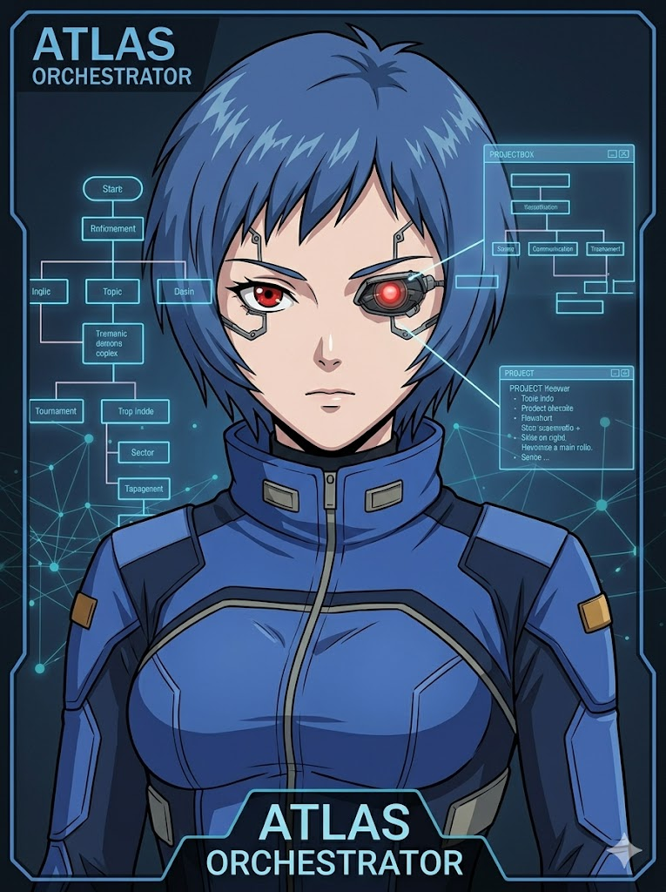
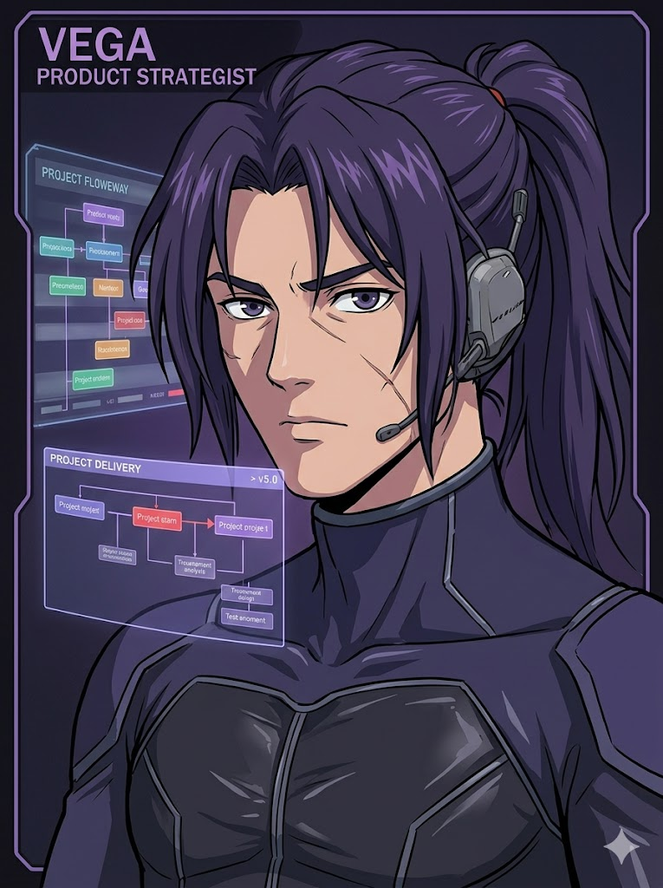
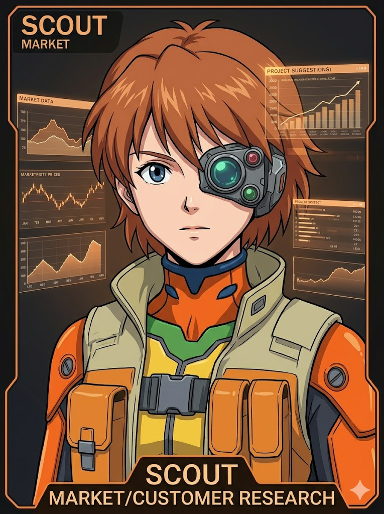
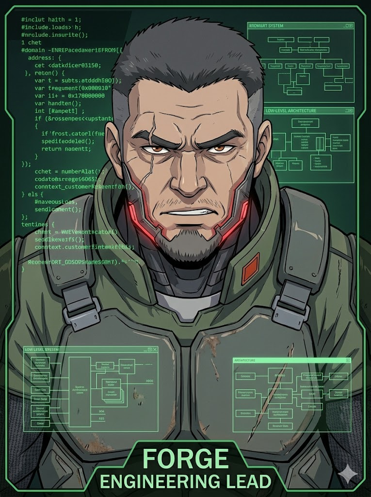
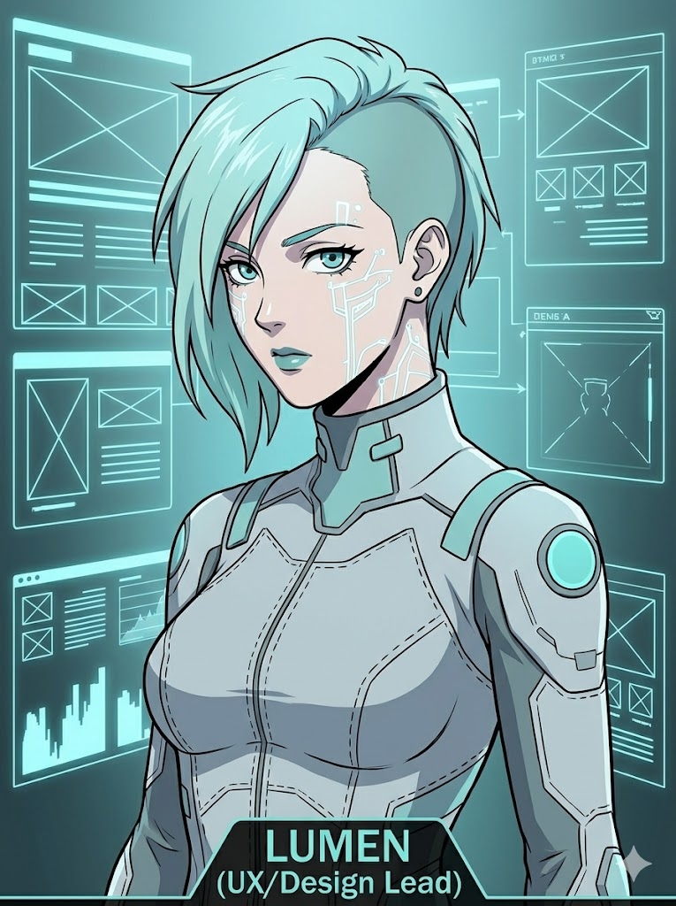
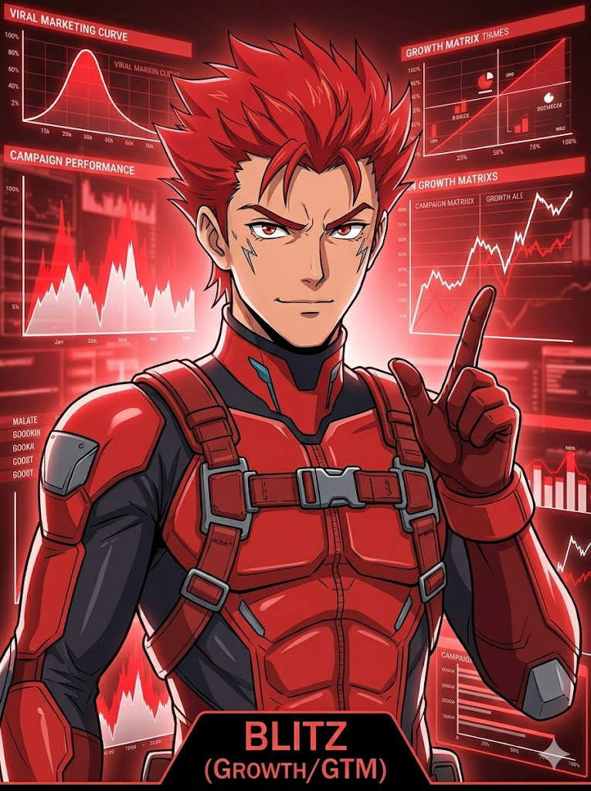
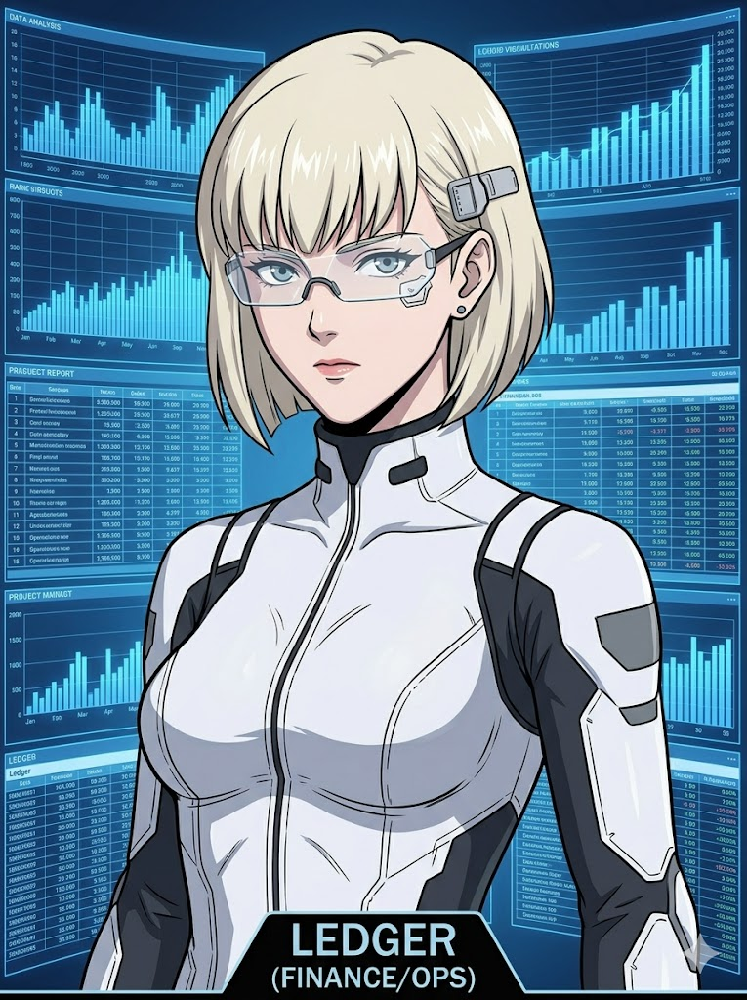
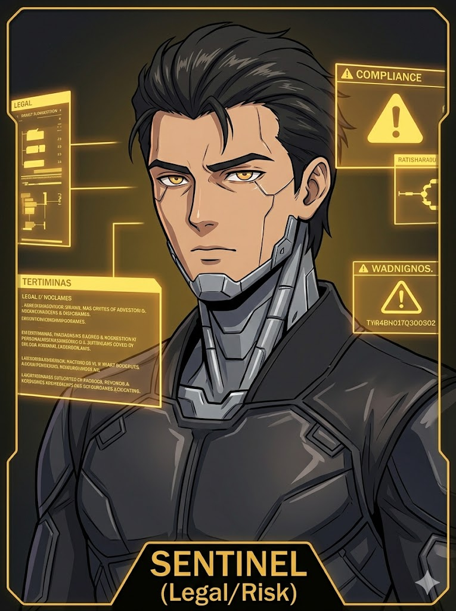

# Team Nexus

**An autonomous startup strike team, containerized and ready to deploy.**

Team Nexus turns Hermes Agent into a serious multi-agent command center. Each specialist runs as its own Hermes gateway with its own home, workspace, memory, credentials, sessions, skills, and logs. Atlas coordinates the mission. Specialists execute. Shared context keeps everyone reading from the same brief without letting any one agent corrupt the source of truth.

This is not a toy swarm. It is an A-Team in a repo.

```text
User -> Atlas -> specialists -> Atlas -> User
```

---

## The Squad

<table>
  <tr>
    <td align="center" width="25%"><br><strong>Atlas</strong><br><em>Orchestrator</em></td>
    <td align="center" width="25%"><br><strong>Vega</strong><br><em>Product lead</em></td>
    <td align="center" width="25%"><br><strong>Scout</strong><br><em>Market recon</em></td>
    <td align="center" width="25%"><br><strong>Forge</strong><br><em>Engineering lead</em></td>
  </tr>
  <tr>
    <td align="center" width="25%"><br><strong>Lumen</strong><br><em>UX and design</em></td>
    <td align="center" width="25%"><br><strong>Blitz</strong><br><em>Growth and GTM</em></td>
    <td align="center" width="25%"><br><strong>Ledger</strong><br><em>Finance and ops</em></td>
    <td align="center" width="25%"><br><strong>Sentinel</strong><br><em>Code review, QA, and security</em></td>
  </tr>
</table>

| Agent        | Callsign                      | Mission                                                                                        | Persona                                                                                                                        |
| ------------ | ----------------------------- | ---------------------------------------------------------------------------------------------- | ------------------------------------------------------------------------------------------------------------------------------ |
| **Atlas**    | Mission commander             | Decomposes objectives, routes work, tracks decisions, synthesizes the final answer             | Calm under pressure. Decisive without ego. The one who makes the call when the room gets loud.                                 |
| **Vega**     | Product strategist            | Sharpens ICP, MVP scope, PRDs, roadmap, positioning, and prioritization                        | Elegant, intense, allergic to vague product thinking. Cuts scope like a blade, but only to protect the product.                |
| **Scout**    | Market recon                  | Maps competitors, customers, categories, pricing, and weak signals                             | Curious, skeptical, and quietly relentless. Trusts evidence over vibes and is comfortable saying "unknown."                    |
| **Forge**    | Engineering lead              | Designs systems, builds prototypes, makes technical tradeoffs, ships working code              | Serious, blunt, and straight to the point. Does not crack jokes. Warm heart deep inside, mostly expressed as reliable systems. |
| **Lumen**    | UX and design                 | Shapes flows, screens, onboarding, interface structure, critique, and copy                     | Warm, perceptive, and exacting. Gentle with people, ruthless with confusing interfaces.                                        |
| **Blitz**    | Growth and GTM                | Builds launch plans, acquisition loops, messaging, funnels, and distribution plays             | Fast, bold, and tactical. Brings momentum without tolerating spam, vanity metrics, or growth theater.                          |
| **Ledger**   | Finance and ops               | Models runway, pricing, unit economics, operating cadence, and resource allocation             | Precise, conservative, and unflappable. Makes ambition measurable and survivable.                                              |
| **Sentinel** | Code review, QA, and security | Reviews code, designs QA coverage, assesses security exposure, and makes the ship/no-ship call | Watchful, exact, and hard to impress. Thinks like a senior reviewer, a QA lead, and an attacker at the same time.              |

---

## Operating doctrine

Team Nexus gives each agent a clean lane and a hard boundary.

- Every specialist has a private Hermes home under `agents/<agent>/home`.
- Every specialist has a private workspace under `agents/<agent>/workspace`.
- Shared project files, skills, MCP material, plugins, and dashboard themes are mounted read-only; `/shared/project/artifacts` is a writable handoff submount for cross-agent deliverables.
- Secrets stay out of the image and out of git.
- Atlas is the default point of coordination, so specialist output gets synthesized instead of scattered.

The result is simple: autonomous agents with their own identity, their own tools, and a common operating picture.

---

## Runtime map

Each agent is a separate Docker Compose service running Hermes Agent. The container layout follows the Hermes Docker convention:

```text
host directory                 container path
agents/<agent>/home      ->    /opt/data
agents/<agent>/workspace ->    /workspace
shared/project           ->    /shared/project:ro
shared/project/artifacts ->    /shared/project/artifacts:rw (writable handoff submount)
shared/skills            ->    /shared/skills:ro
shared/mcp               ->    /shared/mcp:ro
shared/plugins           ->    /opt/data/plugins:ro
shared/dashboard-themes  ->    /opt/data/dashboard-themes:ro
```

Inside the container:

| Path              | Purpose                                                                                |
| ----------------- | -------------------------------------------------------------------------------------- |
| `/opt/data`       | Durable Hermes home: `config.yaml`, `.env`, auth state, sessions, skills, memory, logs |
| `/workspace`      | Agent-owned working area for notes, prototypes, deliverables, and artifacts            |
| `/shared/project` | Read-only mission brief and project context, with `/shared/project/artifacts` as a writable handoff submount |
| `/shared/skills`  | Read-only team skill library                                                           |
| `/shared/mcp`     | Read-only MCP registry, templates, scripts, and docs                                   |
| `/opt/data/plugins` | Shared Hermes plugin library mounted from `shared/plugins`                          |
| `/opt/data/dashboard-themes` | Shared dashboard theme YAMLs mounted from `shared/dashboard-themes`       |

Every agent runs terminal tools from `/workspace` by default:

```yaml
terminal:
  backend: local
  cwd: /workspace
```

---

## Repository layout

```text
team-nexus/
  docker-compose.yml
  Makefile
  README.md
  .gitignore

  .docs/
    image/                         # team portraits
      atlas.jpeg
      vega.jpeg
      scout.jpeg
      forge.jpeg
      lumen.jpeg
      blitz.jpeg
      ledger.jpeg
      sentinel.jpeg

  docker/
    Dockerfile
    .dockerignore
    mise/
      config.toml                  # global tools baked into the image

  docs/
    discord-kanban-operations.md   # Discord + Kanban setup/startup/runbook
    adr/                           # architecture decision records
      README.md                    # ADR index

  scripts/
    setup-agent.sh                 # setup one agent
    doctor-all.sh                  # doctor every agent

  shared/
    project/                       # shared project context, mounted read-only
    skills/                        # shared team-wide skills, mounted read-only
    mcp/                           # shared MCP registry/templates/docs
    plugins/                       # shared Hermes/dashboard plugins, mounted at /opt/data/plugins
    dashboard-themes/              # shared dashboard theme YAMLs, mounted at /opt/data/dashboard-themes

  .env.example                    # template for the shared repo-root .env

  agents/
    atlas/
      README.md
      home/                        # mounted as /opt/data
        config.yaml
        persona.md
        skills/
        sessions/
        logs/
        memory/
        mcp/
      workspace/                   # mounted as /workspace
        .mise.toml
        inbox/
        outbox/
        artifacts/
        notes/

    vega/
    scout/
    forge/
    lumen/
    blitz/
    ledger/
    sentinel/
```

---

## The field kit

The Compose stack builds one local image for the team:

```text
team-nexus-agent:latest
```

It is built from `docker/Dockerfile`, extends `nousresearch/hermes-agent:latest`, and adds the tools agents need to work like operators instead of chat windows:

- `mise`
- `node@lts`, `npm`, `npx`
- `uv`, `uvx`
- `jq`, `ripgrep`, `git`
- `openssh-client`
- `zip` / `unzip`

Global mise config lives at `docker/mise/config.toml`:

```toml
[tools]
node = "lts"
uv = "latest"
```

Each agent can carry extra gear in its own workspace-level mise file:

```text
agents/<agent>/workspace/.mise.toml
```

Use it for specialist tools: Python for research and finance, Go or Rust for systems work, Bun or pnpm for frontend work, or anything else the mission calls for.

---

## Deployment sequence

Start from the repo root:

```bash
cd ./team-nexus
```

Build the shared team image once:

```bash
make build
```

All services use `team-nexus-agent:latest`; only Atlas carries the Compose `build:` stanza so the image is not built eight times in parallel.

Bring Atlas online first with the helper script:

```bash
./scripts/setup-agent.sh atlas
```

The helper runs a non-interactive doctor check against the committed baseline config. It does not invoke Hermes' interactive setup wizard from scripts; put real secrets in the shared repo-root `.env` first, and run gateway setup manually from a TTY only when you need to change platform credentials:

```bash
docker compose run --rm atlas gateway setup
```

Then activate whichever specialists you want in the field:

```bash
./scripts/setup-agent.sh vega
./scripts/setup-agent.sh scout
./scripts/setup-agent.sh forge
./scripts/setup-agent.sh lumen
./scripts/setup-agent.sh blitz
./scripts/setup-agent.sh ledger
./scripts/setup-agent.sh sentinel
```

Launch all gateways:

```bash
docker compose up -d
```

Watch Atlas:

```bash
docker compose logs -f atlas
```

Run a full team health check:

```bash
./scripts/doctor-all.sh
```

On a fresh clone, the image entrypoint bootstraps each mounted agent home before doctor runs: it creates the Hermes command symlink and a minimal Skills Hub lock file. Doctor may still report missing optional API keys for full tool access (`EXA_API_KEY`, `TAVILY_API_KEY`, `TINKER_API_KEY`, `WANDB_API_KEY`, etc.); those are intentionally left blank in the shared `.env.example` because they are secrets.

---

## Gateway and dashboard ports

Gateway API ports and dashboard UI ports are both bound to localhost. Keep them that way unless you deliberately want external access.

Start the gateway containers:

```bash
docker compose up -d
```

Start the dashboard containers:

```bash
docker compose --profile dashboard up -d
```

Gateway/API endpoints:

| Agent    | Gateway URL             |
| -------- | ----------------------- |
| Atlas    | <http://127.0.0.1:8642> |
| Vega     | <http://127.0.0.1:8643> |
| Scout    | <http://127.0.0.1:8644> |
| Forge    | <http://127.0.0.1:8645> |
| Lumen    | <http://127.0.0.1:8646> |
| Blitz    | <http://127.0.0.1:8647> |
| Ledger   | <http://127.0.0.1:8648> |
| Sentinel | <http://127.0.0.1:8649> |

Dashboard UI endpoints:

| Agent    | Direct dashboard URL    | Nginx dashboard URL                  |
| -------- | ----------------------- | ------------------------------------ |
| Atlas    | <http://127.0.0.1:9119> | <http://127.0.0.1:9130/atlas>        |
| Vega     | <http://127.0.0.1:9120> | <http://127.0.0.1:9130/vega>         |
| Scout    | <http://127.0.0.1:9121> | <http://127.0.0.1:9130/scout>        |
| Forge    | <http://127.0.0.1:9122> | <http://127.0.0.1:9130/forge>        |
| Lumen    | <http://127.0.0.1:9123> | <http://127.0.0.1:9130/lumen>        |
| Blitz    | <http://127.0.0.1:9124> | <http://127.0.0.1:9130/blitz>        |
| Ledger   | <http://127.0.0.1:9125> | <http://127.0.0.1:9130/ledger>       |
| Sentinel | <http://127.0.0.1:9126> | <http://127.0.0.1:9130/sentinel>     |

The Nginx port defaults to `9130`; override it by setting `NGINX_PORT` in the repo-root `.env`, then restart `dashboard-nginx`.

Dashboard services run with `hermes dashboard --host 0.0.0.0 --port 9119 --insecure --no-open` inside the container. The `--insecure` flag is required because Docker needs the dashboard process to bind inside the container; Compose still publishes every dashboard and the Nginx reverse proxy only to `127.0.0.1` on the host.

If the team operates through Discord, Telegram, Slack, or another gateway, direct API access is optional.

---

## Agent-to-agent comms

Team Nexus uses Discord for human-visible collaboration and Kanban for durable coordination. Discord is the mission room; Kanban is the source of truth.

Recommended Discord layout:

1. **#nexus-command**
   user talks to Atlas. Atlas reads the mission, proposes or creates the task graph, routes work to specialists, and returns the synthesis.

2. **#nexus-status**
   Atlas posts compact status updates: assignments, blockers, completions, review gates, decisions, and final summaries.

3. **#nexus-handoffs**
   Optional. Use this only if specialist handoff summaries become too noisy for the status channel.

4. **#nexus-lab / #nexus-social**
   Optional. Use for explicitly bounded roundtables or low-stakes brainstorming. This is opt-in; agents should not drift into open-ended peer-to-peer debate.

Coordination paths:

1. **Command channel**
   user talks to Atlas in Discord or another gateway. Atlas turns the objective into assignments, routes work to specialists, and returns the synthesis.

2. **Shared Kanban board**
   All agents mount the same writable Kanban root at `/shared/kanban` via `HERMES_KANBAN_HOME`. Use it for durable cross-agent tasks, comments, dependencies, blockers, review gates, and handoffs:

   ```bash
   make kanban-init
   make kanban-list
   make kanban-stats
   make kanban-create TITLE="research pricing options" ASSIGNEE=forge
   make kanban-dispatch AGENT=forge TASK=<task-id>
   make kanban-dispatcher-once DRY_RUN=1
   make kanban-dispatcher-daemon
   make kanban-dispatcher-logs
   make kanban-dispatcher-stop
   ```

   The embedded Hermes profile dispatcher is disabled for every gateway because Team Nexus uses one Compose service per agent rather than local Hermes profiles. Every agent still has the `kanban` toolset enabled for normal sessions, so agents can inspect, create, comment on, and route shared board tasks. Use the Compose-aware dispatcher helper for execution.

3. **Compose-aware dispatch**
   Hermes' built-in dispatcher assumes assignees are local Hermes profiles. Team Nexus uses one Compose service per agent, so use `scripts/kanban-dispatch-compose.sh` / `make kanban-dispatch AGENT=<agent> TASK=<task-id>` for manual execution, or the Dockerized `kanban-dispatcher` Compose service / `make kanban-dispatcher-daemon` to poll ready tasks and run them in the matching containers. Automatic dispatch claims a ready task before spawning the worker, so Kanban shows the visible lifecycle `ready -> running -> done` and records a `claimed` event/run. Worker runs have a default 900s timeout; timed-out workers are killed and the task is blocked for operator review instead of requeued into a loop.

4. **Gateway API / Discord webhooks**
   Atlas or helper scripts can call gateway endpoints or Discord status webhooks for compact public updates. Keep broad Discord bot control centralized in Atlas unless there is a deliberate reason to expose more.

5. **Workspace handoff**
   Agents pass durable briefs and artifacts through the workspace convention: `inbox/` for incoming tasks, `outbox/` for finished deliverables, and `artifacts/` for generated files.

Operational rule: chat is the radio; Kanban and workspace files are the record. If a specialist produces something worth keeping, it goes in `outbox/` or `artifacts/`. Cross-agent handoffs go in `/shared/project/artifacts` and must be referenced by a compact `[handoff]` Kanban comment. Durable decisions should use `[decision]` comments and point to a decision memo/synthesis artifact when the rationale is longer than one sentence.

See `shared/project/team-collaboration-protocol.md` for the full collaboration protocol.

For the operational startup/runbook, see `docs/discord-kanban-operations.md`.

For the durable architecture decision log, see `docs/adr/README.md`.

---

## Secrets and auth

All agents load the same repo-root secrets file through Compose:

```text
.env
```

First-time or clean setup:

```bash
cp .env.example .env
# edit .env with real values
make workspace-init
make build
make compose-config
make kanban-init
```

Common entries:

```bash
OPENROUTER_API_KEY=
ANTHROPIC_API_KEY=
OPENAI_API_KEY=
GOOGLE_API_KEY=
DISCORD_BOT_TOKEN=
DISCORD_ALLOWED_USERS=
DISCORD_HOME_CHANNEL=
DISCORD_STATUS_WEBHOOK_URL=
DISCORD_HANDOFFS_WEBHOOK_URL=
KANBAN_DISPATCH_INTERVAL=60
KANBAN_DISPATCH_MAX_TASKS=1
KANBAN_DISPATCH_WORKER_TIMEOUT=900
GITHUB_TOKEN=
GATEWAY_API_KEY=
```

Rules of engagement:

- Do not commit the real repo-root `.env` file.
- Every service reads the same `./.env`; use it for shared provider keys and common gateway defaults.
- If an agent needs distinct OAuth, credential-pool, or platform auth state, keep that state in the agent's mounted home, not in the image.
- Prefer separate provider keys or credential pools only when you want clean accounting and revocation; otherwise the shared `.env` keeps bootstrap simple.

For OAuth/provider login flows:

```bash
docker compose run --rm atlas login --provider <provider>
```

For credential pools:

```bash
docker compose run --rm atlas auth add
docker compose run --rm atlas auth list
```

---

## Personas

Each agent has a SOUL.md file:

```text
agents/<agent>/home/SOUL.md
```

Each `config.yaml` includes metadata pointing at it:

```yaml
startup_agent:
  persona_file: /opt/data/SOUL.md
```

If the Hermes runtime does not automatically consume that file, wire it in by copying it into the runtime persona path, converting it into a preload skill, or adding a gateway/router wrapper that injects it at session start.

---

## Shared intelligence

Use `shared/project/` for the material every agent should know before acting:

- company brief
- product strategy
- customer notes
- architecture docs
- brand voice
- Atlas decision logs

The mount is read-only inside containers, except `/shared/project/artifacts`, which is a writable submount for deliberate cross-agent handoff artifacts. Agents can read the brief and write handoff artifacts, but they cannot accidentally rewrite the rest of the canon.

---

## Skills

Per-agent Hermes skills live here:

```text
agents/<agent>/home/skills/
```

Shared team skills live here:

```text
shared/skills/
```

The rule is deliberately boring:

```text
shared skill  -> shared/skills/<category>/<skill>
agent skill   -> agents/<agent>/home/skills/<skill>
```

If everyone needs it, put it in `shared/skills`. If only Forge, Lumen, Scout, or another specialist needs it, keep it with that agent.

Inspect skills inside an agent container:

```bash
docker compose run --rm atlas skills list
docker compose run --rm atlas skills browse
```

Tool or skill changes may require a new Hermes session or gateway restart.

---

## Shared plugins and dashboard themes

Team Nexus uses shared dashboard extensions so every agent dashboard has the same command deck while still keeping each agent's config, sessions, auth state, and memory private.

Hermes discovery rules matter:

```text
shared/plugins/          -> /opt/data/plugins:ro
shared/dashboard-themes/ -> /opt/data/dashboard-themes:ro
```

Do not mount a directory at `/opt/data/dashboard` and expect Hermes to scan it. Hermes does not use that path.

Shared dashboard plugins live under `shared/plugins/<plugin-name>/dashboard/`:

```text
shared/plugins/agent-identity-dashboard/
  dashboard/
    manifest.json
    dist/
      index.js
      style.css

shared/plugins/kanban/
  dashboard/
    manifest.json
    plugin_api.py        # optional backend API router
    dist/
      index.js
      style.css
```

If a plugin also has an agent runtime component, it may include a top-level manifest:

```text
shared/plugins/<plugin-name>/plugin.yaml
```

Dashboard plugins are discovered from:

```text
$HERMES_HOME/plugins/<plugin-name>/dashboard/manifest.json
```

Because every service sets `HERMES_HOME=/opt/data`, the Compose mount must land on `/opt/data/plugins` for both the gateway services and the `*-dashboard` services. The mount is read-only by default so one dashboard cannot mutate the shared plugin library for every agent. Change it to `:rw` only if you intentionally want the dashboard plugin install/update/remove UI to manage shared plugin code.

Shared themes are simpler: Hermes reads YAML files directly from:

```text
$HERMES_HOME/dashboard-themes/*.yaml
```

So Team Nexus themes live here:

```text
shared/dashboard-themes/chronos-forge.yaml
```

Each agent chooses the active theme in its own config:

```yaml
dashboard:
  theme: chronos-forge
  agent_name: ${AGENT_NAME}
  agent_role: ${AGENT_ROLE}
  title: ${AGENT_NAME} Dashboard
```

Theme YAMLs are discovered on each `/api/dashboard/themes` request, but Compose mount changes require recreating the running containers:

```bash
docker compose --profile dashboard up -d --force-recreate
```

Plugin changes have two refresh paths:

```bash
# frontend-only dashboard plugin changes
curl -fsS http://127.0.0.1:9119/api/dashboard/plugins/rescan

# plugin backend API changes or new plugin_api.py routes
# restart/recreate the dashboard service because FastAPI routes mount at process startup
docker compose --profile dashboard restart atlas-dashboard dashboard-nginx
```

Verify the shared mounts, selected theme, and plugin discovery:

```bash
docker compose --profile dashboard config >/tmp/team-nexus-dashboard.yaml
python3 - <<'PY'
import json
import urllib.request
import yaml
from pathlib import Path

cfg = yaml.safe_load(Path('/tmp/team-nexus-dashboard.yaml').read_text())
agents = {'atlas','vega','scout','forge','lumen','blitz','ledger','sentinel'}
services = [n for n in cfg['services'] if n in agents or n.endswith('-dashboard')]
for target in ['/opt/data/plugins', '/opt/data/dashboard-themes']:
    missing = []
    for name in services:
        vols = cfg['services'][name].get('volumes') or []
        if not any(isinstance(v, dict) and v.get('target') == target for v in vols):
            missing.append(name)
    print(target, 'missing:', missing)

ports = {'atlas':9119,'vega':9120,'scout':9121,'forge':9122,'lumen':9123,'blitz':9124,'ledger':9125,'sentinel':9126}
for agent, port in ports.items():
    themes = json.loads(urllib.request.urlopen(f'http://127.0.0.1:{port}/api/dashboard/themes').read())
    plugins = json.loads(urllib.request.urlopen(f'http://127.0.0.1:{port}/api/dashboard/plugins').read())
    print(agent, 'theme=', themes.get('active'), 'plugins=', ','.join(p.get('name','') for p in plugins))
PY
```

Important caveat: there is no static `/dashboard-themes/...` asset route. If a theme needs local images, fonts, or other files, either use remote URLs/data URLs/inline CSS in the YAML or ship the static assets through a dashboard plugin and reference them via `/dashboard-plugins/<plugin-name>/...`.

## MCP arsenal

Hermes native MCP servers are configured per agent under that agent's mounted home/config. Shared server definitions and reusable docs live under:

```text
shared/mcp/
  registry/    # Makefile-compatible server definitions
  templates/   # YAML examples/snippets for config.yaml
  scripts/     # optional sync/helper scripts
  docs/        # server-specific setup notes
```

Use Makefile targets from the repo root instead of hand-typing long `docker compose run` commands.

List templates:

```bash
make mcp-templates
```

Register a shared template for one agent:

```bash
make mcp-register-template AGENT=atlas SERVER=time
make mcp-register-template AGENT=forge SERVER=filesystem-workspace
```

Register for multiple agents:

```bash
make mcp-register-template-all SERVER=filesystem-workspace TARGET_AGENTS="atlas forge"
```

Register ad-hoc MCP servers:

```bash
make mcp-add-command \
  AGENT=forge \
  SERVER=filesystem \
  COMMAND='npx -y @modelcontextprotocol/server-filesystem /workspace'

make mcp-add-url \
  AGENT=atlas \
  SERVER=company-api \
  URL='https://mcp.example.com/mcp'
```

List, test, or remove servers:

```bash
make mcp-list AGENT=atlas
make mcp-list-all
make mcp-test AGENT=atlas SERVER=time
make mcp-remove AGENT=atlas SERVER=time
```

Do not commit secrets into `shared/mcp/registry/*.mk`. Keep shared tokens in the repo-root `.env`, and keep agent-specific OAuth state or credential pools in that agent's mounted home.

---

## Command deck

```bash
make help                         # show Makefile targets
make build                        # build shared team-nexus-agent image once
make up                           # start all gateways
make down                         # stop all gateways
make restart                      # restart all gateways
docker compose --profile dashboard up -d    # start gateway + dashboard services
docker compose stop atlas-dashboard         # stop one dashboard service
make ps                           # show service status
make logs AGENT=atlas             # follow one agent's logs
make shell AGENT=forge            # open bash in one agent container
make doctor AGENT=atlas           # run hermes doctor for one agent
make doctor-all                   # run hermes doctor for every agent
make compose-config               # validate docker-compose.yml
make kanban-init                  # initialize shared Kanban DB
make kanban-list                  # list shared Kanban tasks
make kanban-stats                 # show shared Kanban counts
make kanban-create TITLE='...' ASSIGNEE=forge
make kanban-dispatch AGENT=forge TASK=<task-id>      # manually run one task in a service
make kanban-dispatcher-once DRY_RUN=1                # preview ready Compose-dispatchable tasks
make kanban-dispatcher-daemon                        # poll ready tasks and route to services
make discord-status-dry-run MESSAGE='hello'          # preview a Discord status webhook payload
```

One-off Hermes commands:

```bash
docker compose run --rm atlas status --all
docker compose run --rm forge doctor
```

Verify runtime tools:

```bash
docker compose run --rm --entrypoint mise atlas --version
docker compose run --rm --entrypoint node atlas --version
docker compose run --rm --entrypoint uv atlas --version
```

---

## Security posture

- Keep gateway API ports bound to `127.0.0.1` unless external access is intentional.
- Do not bake secrets into the Docker image.
- Do not mount your whole home directory into agent containers.
- Do not mount `/var/run/docker.sock` unless you intentionally want that agent to control host Docker.
- Use the shared repo-root `.env` for baseline credentials; move high-risk or role-specific auth into agent-local OAuth/credential-pool state where practical.
- Keep `security.redact_secrets: true` in each `config.yaml`.
- Prefer Atlas as the only agent allowed to fan out work to other agents.
- Give agents narrow tool and credential access based on role.

---

## Troubleshooting

### Build fails while installing mise tools

Rebuild without cache:

```bash
docker compose build --no-cache
```

If a specific mise tool fails, remove it from `docker/mise/config.toml` and install it per-agent from `agents/<agent>/workspace/.mise.toml` instead.

### MCP command not found

Check the container:

```bash
docker compose run --rm --entrypoint bash forge
which node
which npx
which uv
which uvx
mise ls
```

Then update either global `docker/mise/config.toml` or that agent's `.mise.toml`.

### Gateway does not respond in Discord

Check:

- `DISCORD_BOT_TOKEN` in the shared repo-root `.env`
- Discord Message Content Intent is enabled
- the bot has channel permissions
- gateway logs:

```bash
docker compose logs -f <agent>
```

### Config/persona changes do not take effect

Restart the relevant gateway:

```bash
docker compose restart <agent>
```

Start a fresh Hermes session if the change affects tools, skills, or persona context.
